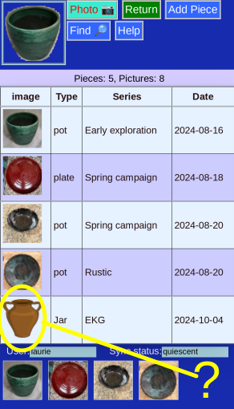
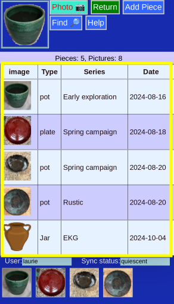
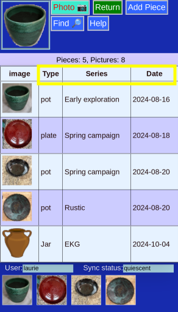

# All Pieces

This is a list of all the pieces in the database. 

### No Picture

Even pieces that have no pictures will appear (unlike the thumbnail choices on the bottom).

### The List

The list is sortable table with a picture and some identifying information. Click anywhere in the row to go to that piece's entry.

### Sortable

Clink on any column heading to sort on that field. Click again to reverse the sort order. 