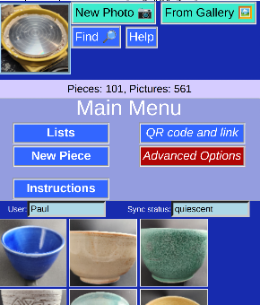

# PotHolder
## *Convenient mobile database for Ceramic Artists*

## Summary

**Potholder** is a web-based program that lets you keep track of your ceramic pieces. It works well on phones, laptops and tablets, and will synchronize automatically between all the devices when the internet is available.

The database includes images, kiln and glaze data, and other production processes.

You don't have to install anything on your phone to use it -- no app -- it's all there in the web page. You don't even have to be on-line to use it.

Even better, it's free, open source, and works almost all types of devices.

## Setup

Access to a central server is needed. Either you are granted access to an existing one, or for the more tech-savvy, complete instructions on setting up your own server are here.

## Not a potter?

Although **Potholder** is set up for pottery worlflow (Glaze, Kiln, etc...) it could be easily adapted to other realms. The source code is completely available and the author would be happy to help.