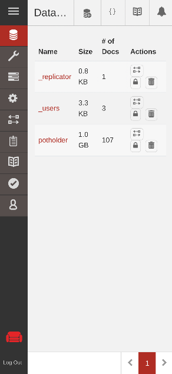

# Database setup

**Potholder** uses [couchdb](https://couchdb.apache.org/) as theserver database.

## Features

+ A document-based database
  + Non SQL although SQL queries are supported as an add-on
  + Communication via http with clients
  + Strong replication design
+ Open source well maintained code base
+ Eventual consistency supports disconnected operation

## Installation

On a debian 13 system:

    sudo apt install couchdb

## Configuration

### configuration file

located at `/opt/couchdb/etc/local.d/10-admins.ini`

+ 

## Management

Web-base management console:

